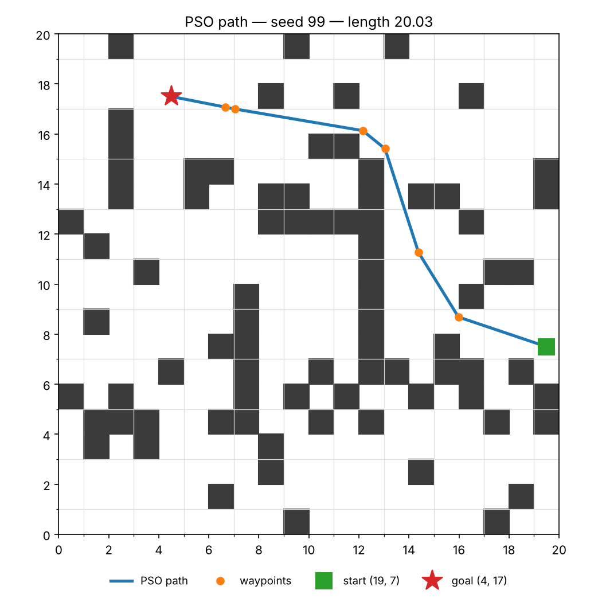
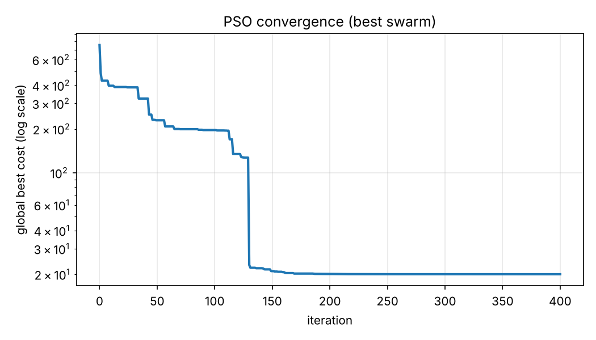

# Swarm-Based Path Planning with Obstacles (PSO)

**Swarm Intelligence Lab — Assignment 1** · Bahria University, Dept. of Computer Science

| | |
|---|---|
| **Name** | Hanzala |
| **Roll No.** | 099 |
| **Seed used** | `99` → `random.seed(99)` (defined as `ROLL_NUMBER = 99` in `grid.py`) |
| **Algorithm** | Particle Swarm Optimization (PSO) |

---

## My problem instance (seed = 99)

Nothing is hard-coded — the grid, obstacles, start and goal are all generated from the seed in `grid.py`:

| Property | Value |
|---|---|
| Grid size | 20 × 20 |
| Obstacles | 80 blocked cells (2 random wall segments + scattered cells up to 20 % density) |
| Start | cell `(19, 7)` |
| Goal | cell `(4, 17)` |

A BFS check guarantees the goal is reachable from the start; if not, the generator draws again from the same seeded stream (so the result is still deterministic).

## Result

| Metric | Value |
|---|---|
| Best path length | **20.03** cells |
| Collisions | **0** (collision-free) |
| Straight-line distance (lower bound) | 18.03 |
| Run time | ~22 s (5 swarms × 80 particles × 400 iterations) |





---

## Approach

**1. Encoding.** Each particle is one candidate path. Its position vector holds the (x, y) coordinates of
`K = 6` intermediate waypoints in continuous space:

```
particle = [x1, y1, x2, y2, ..., x6, y6]
path     = Start → w1 → w2 → ... → w6 → Goal
```

**2. Fitness (minimised).**

```
cost = path length
     + 100 × (length of path lying inside obstacles)
     +  50 × (number of segments that collide)
```

Collision check: every segment is sampled at 64 points; each point (plus a small 0.15-cell clearance box around it, so the path cannot cut obstacle corners) is tested against the obstacle grid. Leaving the map also counts as a collision. Because of the large penalty, any collision-free path is always better than any colliding one.

**3. PSO update** (global-best PSO):

```
v = w·v + c1·r1·(pBest − x) + c2·r2·(gBest − x)
x = x + v          (velocity clamped to ±15 % of grid, position clipped to grid)
```

| Parameter | Value |
|---|---|
| Particles | 80 |
| Iterations | 400 |
| Inertia `w` | linearly decreasing 0.9 → 0.4 (explore first, then exploit) |
| `c1`, `c2` | 1.6, 1.6 |
| Waypoints `K` | 6 |

**4. Initialisation.** Half of the swarm starts near the straight line Start→Goal (plus Gaussian noise), the other half is uniformly random over the map, for a balance of exploitation and exploration.

**5. Multi-start.** A single swarm sometimes converges to a local minimum where the path cuts through a thin wall (you can see this in the console as cost ≈ 180). So 5 independent swarms are run with seeds 99…103 and the best **collision-free** result is kept.

## Project structure

```
grid.py        # seeded grid / obstacle / start / goal generation (+ BFS reachability check)
pso.py         # PathProblem (fitness + collision check) and the PSO optimiser
visualize.py   # matplotlib plots (grid + path, convergence curve)
main.py        # entry point / CLI
results/       # output plots
images/        # hand-drawn flow diagram
```

## How to run

```bash
git clone https://github.com/<your-username>/swarm-pathplanning-099.git
cd swarm-pathplanning-099
pip install -r requirements.txt
python main.py
```

Optional arguments:

```bash
python main.py --seed 99 --size 20 --particles 80 --iters 400 --waypoints 6 --runs 5
```

Output: best cost, path length, collision count and waypoint list in the terminal; `results/path.png` and `results/convergence.png` are saved.

## Hand-drawn flow diagram


Flow: Initialize (seed 99) → Generate grid & obstacles → Place start/goal → Initialise swarm → Evaluate candidate paths → Check collision with obstacles → Update pBest/gBest → Update velocity & position → Stopping condition (400 iterations, 5 swarms) → Output best path.
